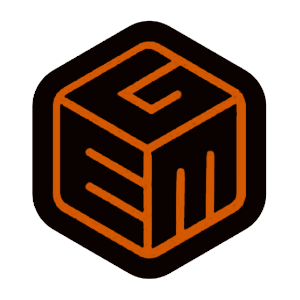

# Battle Pong



Just a _simple_ game demo from BSO Gemo.

## UwU what's this ?
Well altough this game title has **Battle** in it, it doesn't mean this game is sort kind of **Counter Strike, PUBG, Etc**.
So what is it then ?, Well... this game just your ordinary _old-classic-pong_ game but with a small improvements like :
- Power-ups
- Moar Balls !
- ~~Touhou Music !~~
- ~~PTSD~~
- Etc

So basically, you can call it _**Pong on Steroids**_

## How to Install
Because .apk and .exe file are still not available, you can try to launch the game directly by using Godot Engine. 

#### Steps:
1. If you don't have it, you can download it [HERE](https://godotengine.org/download/)

2. Download the game source code as [.ZIP](https://github.com/GemoGame/godot-battle-pong/archive/master.zip) 
or clone it by using GIT

```
git clone https://github.com/GemoGame/godot-battle-pong.git
```

3. Launch the Godot Engine
4. Click **_Scan_** and then select the game source code directory
5. Click on _Battle Pong_ then select **_Run_** (Or you can double click it), and wait until the game assets is loaded
6. Finally click _Play_ button (on top right) or press **F5** to play the game
7. ???
8. Profit 


## Assets Sources
Special thanks to :
- [Menu music](https://www.youtube.com/watch?v=QBMntMPXA98)
- [Game music 1](https://www.youtube.com/watch?v=YIg-WFd0PYI)
- [Game music 2](https://www.youtube.com/watch?v=uW9yLQpvP0c)
- [Big ball power-up sound](http://soundbible.com/2068-Woosh.html)
- [Small ball power-up sound](http://soundbible.com/2067-Blop.html)
- [Fast ball power-up sound](http://soundbible.com/1087-Laser.html)
- [Slow ball power-up sound](http://soundbible.com/670-Swooshing.html)
- [Reflected ball sound](http://soundbible.com/1473-Camera-Flash.html)
- [Destroyed ball sound](http://soundbible.com/1658-Mirror-Breaking.html)

## Game Status
_Unfinished_